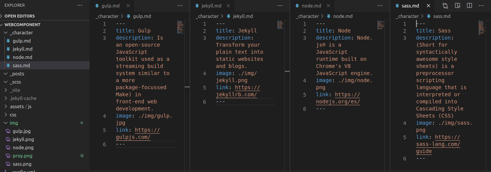
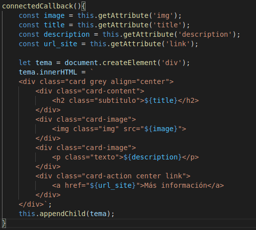

# Práctica4
## Web component

### 1. Pre requisitos

Dado que en esta práctica nos enfocamos únicamente en un webcomponent, no hay pre requisitos. Si se utilizaran las técnologias vistas anteriormente y ya instaladas.

### 2. Proyecto base

Se ha utilizado un proyecto básico de jekyll, se ha dejado predeterminado su header y footer. Lo unico que ha sido modificado ha sido el body.

### 3. Elementos 

Los elemntos a selecionar para probar el webComponent se han definido dentro de la carpeta *"_character"* todos cuentan con los mismos atributos y se llaman dentro del código HTML con un for que recorre toda la colección.

### 4. Web Component

El webcomponent se crea dentro de un fichero *".js"*, dentro de el, crearemos una clase que nos definira nuestro elemento personalizado

Dentro de esta clase a su vez, definimos un *"callback"* que su fin es ejecutarse dentro del ciclo de vida de un elemento. Para este caso utilizaremos el *"connectedCallback"* que se invoca cada vez que se añade un elemento a un documento.

Dentro del **CallBack** tenemos:

- La declaración de las variables donde obtendremos los datos de un objeto

- La creación de un div que permitirá seleccionar el objeto

Por otro lado, también tendremos que definir nuestra elemento personalizado que nos permitirá obtener la información del objeto

Y crear la función para seleccionar y obtener dicho objeto

### 5. Resultado

